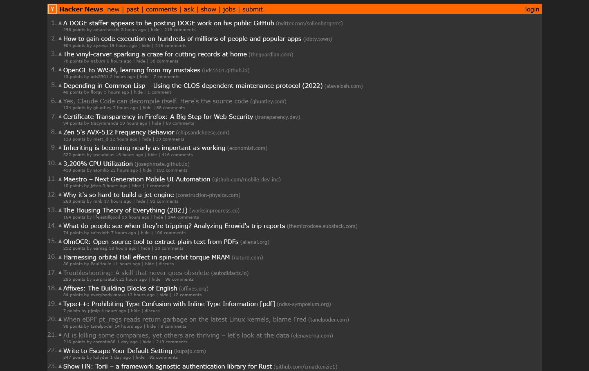

# hacker-news-dark-mode

The color styles from [news.ycombinator.com/news.css](https://news.ycombinator.com/news.css), with the colors altered for dark theme. 

Tip: Load styles into your browser with the [Stylus browser extension](https://add0n.com/stylus.html).

